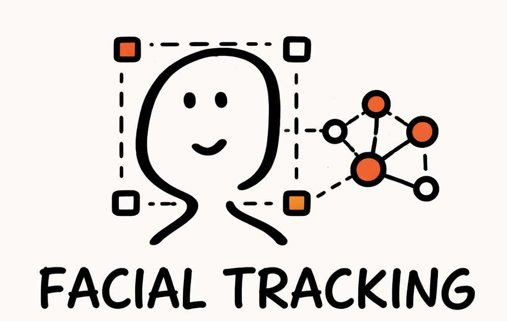

# README



# 1€ Фильтрация

## Концепция One Euro Filter

One Euro Filter - это адаптивный фильтр низких частот, разработанный для сглаживания сигналов в реальном времени. Основная идея заключается в динамической адаптации частоты среза в зависимости от скорости изменения сигнала:

- **Медленные движения**: низкая частота среза → сильное сглаживание (уменьшение jitter)
- **Быстрые движения**: высокая частота среза → минимальная задержка (сохранение отзывчивости)

## Применение в FaceTrack

### Задачи фильтрации

1. **Уменьшение jitter** - высокочастотные шумы от MediaPipe
2. **Сохранение отзывчивости** - быстрая реакция на движения головы
3. **Стабилизация blendshapes** - сглаживание выражений лица

### Гибкая настройка

#### Глобальные параметры

```json
{
    "one_euro_filter": {
        "defaults": {
            "min_cutoff": 0.5,    // Базовая частота среза для малых движений
            "beta": 10.0,          // Чувствительность к скорости движения
            "d_cutoff": 2.0        // Частота среза для производной
        }
    }
}
```

#### Индивидуальная настройка landmarks

```json
{
    "one_euro_filter": {
        "landmarks": {
            "0": [0.3, 5.0],      // Кончик носа - высокая точность
            "1": [0.8, 2.0],      // Уголки глаз - умеренная фильтрация
            "17": [0.2, 15.0]     // Центр подбородка - максимальная отзывчивость
        }
    }
}
```

#### Индивидуальная настройка blendshapes

```json
{
    "one_euro_filter": {
        "blendshapes": {
            "0": [0.1, 8.0],      // Брови вверх - быстрая реакция
            "15": [0.6, 3.0],     // Улыбка - плавные переходы
            "30": [0.4, 5.0]      // Прищуривание - баланс
        }
    }
}
```